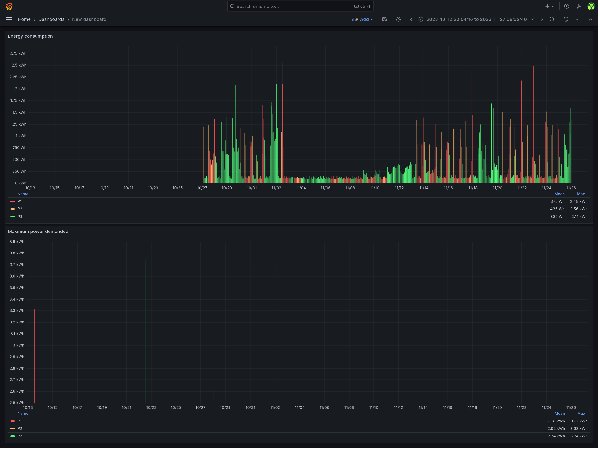

# datadis-exporter

Bash script that uploads the energy consumption and maximum power usage data from the DATADIS API to influxdb on a daily basis

## Dependencies

- [awk](https://www.gnu.org/software/gawk/manual/gawk.html)
- [bash](https://www.gnu.org/software/bash/)
- [coreutils (date)](https://www.gnu.org/software/coreutils/)
- [curl](https://curl.se/)
- [gzip](https://www.gnu.org/software/gzip/)
- [influxdb v2+](https://docs.influxdata.com/influxdb/v2.6/)
- [jq](https://stedolan.github.io/jq/)
- Optional: [make](https://www.gnu.org/software/make/) - for automatic installation support
- [systemd](https://systemd.io/)

## Relevant documentation

- [DATADIS](https://datadis.es/)
- [InfluxDB API](https://docs.influxdata.com/influxdb/v2.6/write-data/developer-tools/api/)
- [Systemd Timers](https://www.freedesktop.org/software/systemd/man/systemd.timer.html)

## Installation

### With the Makefile

For convenience, you can install this exporter with the following command or follow the manual process described in the next paragraph.

```bash
make install
$EDITOR $HOME/.config/datadis_exporter.conf
```

### Manually

1. Copy `datadis_exporter.sh` to `$HOME/.local/bin/` and make it executable.

2. Copy `datadis_exporter.conf` to `$HOME/.config/`, configure it (see the configuration section below) and make it read only.

3. Copy the systemd unit and timer to `$HOME/.config/systemd/user/`:

```bash
cp datadis-exporter.* $HOME/.config/systemd/user/
```

4. and run the following command to activate the timer:

```bash
systemctl --user enable --now datadis-exporter.timer
```

It's possible to trigger the execution by running manually:

```bash
systemctl --user start datadis-exporter.service
```

### Config file

The config file has a few options:

```bash
INFLUXDB_HOST='influxdb.example.com'
INFLUXDB_API_TOKEN='ZXhhbXBsZXRva2VuZXhhcXdzZGFzZGptcW9kcXdvZGptcXdvZHF3b2RqbXF3ZHFhc2RhCg=='
ORG='home'
BUCKET='datadis'
DATADIS_USERNAME='username'
DATADIS_PASSWORD='password'
CUPS='ES0000000000000000XX0X'
DISTRIBUTOR_CODE='1'
```

- `INFLUXDB_HOST` should be the FQDN of the influxdb server.
- `ORG` should be the name of the influxdb organization that contains the energy consumption data bucket defined below.
- `BUCKET` should be the name of the influxdb bucket that will hold the energy consumption data.
- `INFLUXDB_API_TOKEN` should be the influxdb API token value.
  - This token should have write access to the `BUCKET` defined above.
- `DATADIS_USERNAME` and `DATADIS_PASSWORD`should be the credentials used to access the DATADIS website
- `CUPS` should be the Código Unificado de Punto de Suministro (CUPS)
- `DISTRIBUTOR_CODE` should be one of:
  - 1: Viesgo,
  - 2: E-distribución
  - 3: E-redes
  - 4: ASEME
  - 5: UFD
  - 6: EOSA
  - 7: CIDE
  - 8: IDE

## Troubleshooting

Run the script manually with bash set to trace:

```bash
bash -x $HOME/.local/bin/datadis_exporter.sh
```

Check the systemd service logs and timer info with:

```bash
journalctl --user --unit datadis-exporter.service
systemctl --user list-timers
```

## Exported metrics

The consumption DATADIS API call period is limited to the last 30 days by default.
The power call is limited to the current year's first and last day.

- consumption: The energy consumption in kWh
- period: The period type (p1: punta, p2: llano, p3: valle)
- cups: The cups corresponding to the consumption point above
- max_power: The highest electrical power demanded in kWh

## Exported metrics example

```bash
datadis_consumption,cups=ES0000000000000000XX0X,period=1 consumption=0.123 1672610400
datadis_power,cups=ES0000000000000000XX0X,period=1 max_power=0.123 1686869100
```

## Example grafana dashboard

In `datadis-dashboard.json` there is an example of the kind of dashboard that can be built with `datadis-exporter` data:



Import it by doing the following:

1. Create a dashboard
2. Click the dashboard's settings button on the top right.
3. Go to JSON Model and then paste there the content of the `datadis-dashboard.json` file.

## Uninstallation

### With the Makefile

For convenience, you can uninstall this exporter with the following command or follow the process described in the next paragraph.

```bash
make uninstall
```

### Manually

Run the following command to deactivate the timer:

```bash
systemctl --user disable --now datadis-exporter.timer
```

Delete the following files:

```bash
~/.local/bin/datadis_exporter.sh
~/.config/datadis_exporter.conf
~/.config/systemd/user/datadis-exporter.timer
~/.config/systemd/user/datadis-exporter.service
```

## Credits

This project takes inspiration from the following:

- [MrMarble/datadis](https://github.com/MrMarble/datadis)
- [rare-magma/pbs-exporter](https://github.com/rare-magma/pbs-exporter)
- [mad-ady/prometheus-borg-exporter](https://github.com/mad-ady/prometheus-borg-exporter)
- [OVYA/prometheus-borg-exporter](https://github.com/OVYA/prometheus-borg-exporter)
